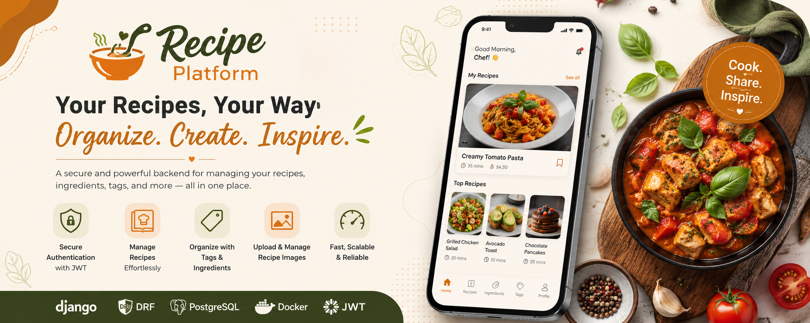

# 🧠 Recipe Platform Backend - Architecture Review
---

---

## 1. High-Level Overview

The system is a **multi-tenant-ready, user-scoped recipe management backend**, built as a modular monolith using Django REST Framework.

At its core, the platform provides authenticated users with the ability to create, manage, and organize personal recipe data, including related metadata, media assets, and taxonomies.

### 🏗 System Architecture

```
Client (Web / Mobile)
        ↓
Django REST API (Dockerized, DRF)
        ↓
PostgreSQL (Primary relational datastore)
        ↓
Media Storage (Local volume → S3-ready)
```

This design prioritizes simplicity, extensibility, and future SaaS scalability.

---

## 2. Domain Architecture

The system is structured into five primary bounded contexts.

---

### 👤 2.1 Identity & Authentication Domain

This domain handles user identity and session management.

**Core responsibilities:**

* User management (UUID-based identity)
* JWT authentication (access & refresh tokens)
* Profile endpoint (`/user/me`)

This functions as an embedded identity service within the monolith, designed for future extraction if needed.

---

### 🍽 2.2 Recipe Domain (Core Aggregate)

The **Recipe** entity serves as the root aggregate of the system.

Each recipe contains:

* Title, description, metadata (time, price, etc.)
* Ownership (user-scoped)

### Relationships:

* One-to-many: Recipe → Images
* Many-to-many: Recipe ↔ Tags
* Many-to-many: Recipe ↔ Ingredients

This domain is the central business logic unit of the system and is designed for high cohesion and relational integrity.

---

### 🏷 2.3 Tag Domain

A lightweight, user-scoped tagging system used for categorization and filtering.

**Characteristics:**

* User-isolated namespace
* Many-to-many relationship with recipes
* Supports flexible classification and discovery

---

### 🧂 2.4 Ingredient Domain

A reusable ingredient registry that allows users to normalize recipe composition.

**Key properties:**

* User-scoped dataset
* Reusable across multiple recipes
* Supports consistent ingredient modeling

This avoids duplication and improves query efficiency for filtering and analytics.

---

### 🖼 2.5 Media Domain

Media is handled via a dedicated model (`RecipeImage`) to decouple file handling from core business data.

**Design decisions:**

* One-to-many relationship with recipes
* Dedicated upload endpoint
* Storage abstraction ready for migration to cloud object storage (e.g., S3)

This ensures scalability and prevents bloating of the primary Recipe table.

---

## 3. Security Model

The system implements a **strict ownership-based access control model**.

### Current Security Features:

* JWT-based stateless authentication
* User-scoped data isolation (all queries filtered by `request.user`)
* UUID-based identifiers for improved security and non-enumerability

### Production Gaps (to be addressed):

* Explicit DRF object-level permissions (`IsOwner`, etc.)
* Rate limiting (API abuse prevention)
* Token revocation / blacklist handling (logout and compromise scenarios)

---

## 4. API Design & Consistency

The API follows RESTful principles with consistent resource modeling.

### Strengths:

* Standard REST endpoints (`/recipes/`, `/recipes/{id}/`)
* Dedicated media upload endpoint
* Filtering support (tags, ingredients)
* OpenAPI schema generation via `drf-spectacular`

### Observations:

Ingredient and tag lifecycle management should explicitly define:

* Creation flow (direct vs nested via recipe payload)
* Update/delete consistency across endpoints

This is important for frontend predictability and long-term maintainability.

---

## 5. Data Model Overview

The system follows a normalized relational design:

```
User
 ├── Recipe
 │     ├── RecipeImage
 │     ├── Recipe ↔ Tag (M2M)
 │     └── Recipe ↔ Ingredient (M2M)
 │
 ├── Tag
 └── Ingredient
```

### Key Design Principle:

All entities are **strictly user-scoped**, ensuring isolation by default and enabling future migration toward a workspace-based SaaS model.

---

## 6. Architectural Strengths

From a systems design perspective, the implementation demonstrates several strong engineering decisions:

### ✅ Modular Monolith Structure

Clear separation of domains within a single deployable unit.

### ✅ Proper Relational Modeling

Normalized schema avoids duplication and ensures data integrity.

### ✅ Media Separation

Decoupling file storage from core entities improves scalability.

### ✅ Stateless Authentication

JWT-based auth supports horizontal scaling.

### ✅ Containerized Deployment

Docker-based setup ensures environment consistency and portability.

---

## 7. Production Gaps & Improvements

To elevate this system to production-grade maturity, the following enhancements are recommended:

---

### 🔐 7.1 Explicit Permission Layer

Introduce DRF-level object permissions:

* `IsOwnerOrReadOnly`
* Queryset-level filtering enforcement

This prevents accidental data leakage as the system grows in complexity.

---

### 🧱 7.2 Service Layer Architecture

Business logic should be decoupled from views/serializers.

Recommended structure:

```
services/
  recipe_service.py
  tag_service.py
  ingredient_service.py
```

Benefits:

* Improved testability
* Better separation of concerns
* Easier scaling of business logic

---

### ⚙️ 7.3 Background Processing

Introduce async task handling (e.g., Celery or RQ):

* Image resizing
* Thumbnail generation
* Heavy media processing

---

### 📊 7.4 Observability & Monitoring

Production systems require visibility:

* Structured logging
* Error tracking (e.g., Sentry)
* Request tracing (future scaling phase)

---

### 🔄 7.5 API Versioning Strategy

Introduce versioned endpoints:

```
/api/v1/recipes/
```

This ensures backward compatibility during future iterations.

---

### 🔍 7.6 Search & Indexing Layer

Future scalability requires:

* PostgreSQL full-text search
* GIN indexing for tags/ingredients

This will significantly improve query performance at scale.

---

## 8. Final System Summary

The platform is best described as:

> A **modular, containerized, user-scoped recipe management backend** built with a clean relational architecture and designed for SaaS extensibility.

---

## 🧭 Deployment Status

The system is currently deployed and accessible:

* Swagger UI: [https://anik-recipe-platform.onrender.com/api/docs](https://anik-recipe-platform.onrender.com/api/docs)
* ReDoc: [https://anik-recipe-platform.onrender.com/api/redoc](https://anik-recipe-platform.onrender.com/api/redoc)
